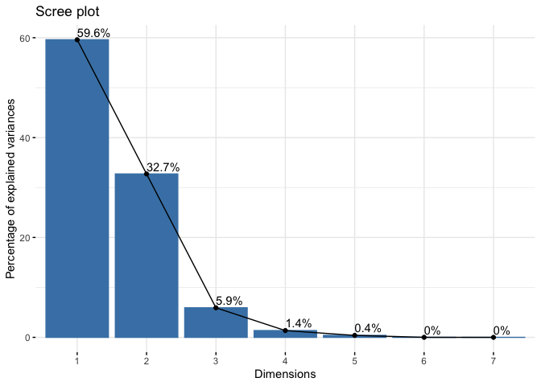
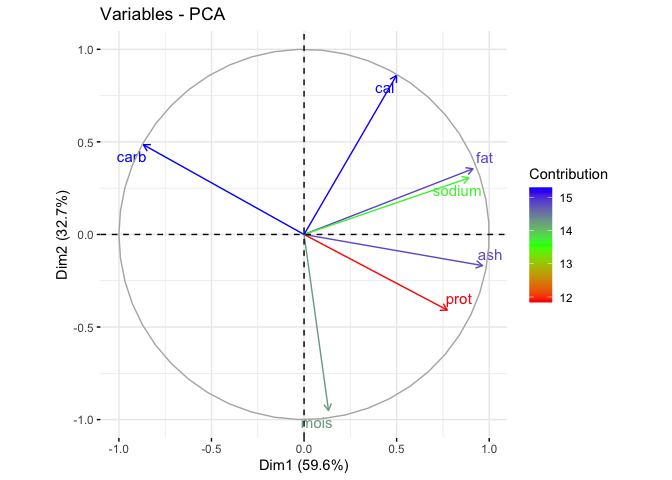
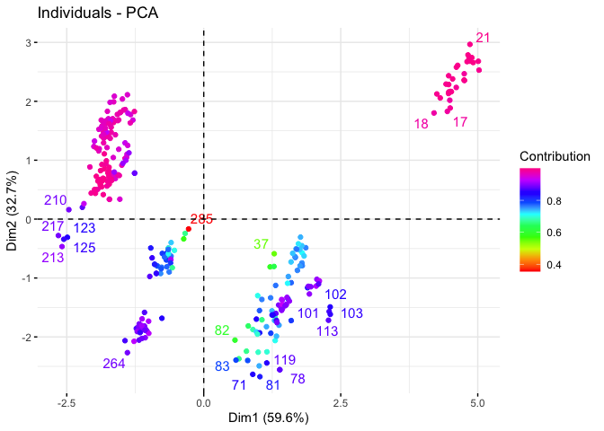
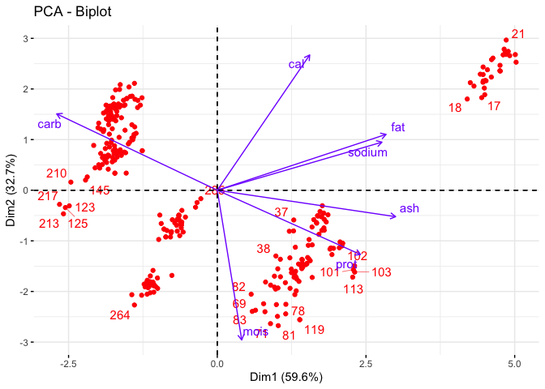

# Principal Component Analysis and Factor Analysis

## Lecture des donnees


```r
Pizza <-readr::read_csv("Pizza.csv")
```

## Affichage 

```r
head(Pizza)
```

```
## # A tibble: 6 × 9
##   brand    id  mois  prot   fat   ash sodium  carb   cal
##   <chr> <dbl> <dbl> <dbl> <dbl> <dbl>  <dbl> <dbl> <dbl>
## 1 A     14069  27.8  21.4  44.9  5.11   1.77  0.77  4.93
## 2 A     14053  28.5  21.3  43.9  5.34   1.79  1.02  4.84
## 3 A     14025  28.4  20.0  45.8  5.08   1.63  0.8   4.95
## 4 A     14016  30.6  20.2  43.1  4.79   1.61  1.38  4.74
## 5 A     14005  30.5  21.3  41.6  4.82   1.64  1.76  4.67
## 6 A     14075  31.1  20.2  42.3  4.92   1.65  1.4   4.67
```
## Appel de la fonction PCA de FactoMineR

```r
Pizza.pca <- FactoMineR::PCA(Pizza[,-c(1,2)],scale.unit=TRUE,graph = FALSE)
```
## Pourcentage d'explication

```r
factoextra::fviz_eig(Pizza.pca,addlabels = TRUE)
```

<!-- -->

Ce graphe nous permet de remarquer que deux composantes principales sont suiffisantes pour représenter 92.318% de l’information ce qui est supérieur à 75% notre pourcentage seuil. 

## Extraction des resultats

```r
Pizza.var<-factoextra::get_pca_var(Pizza.pca)
Pizza.var
```

```
## Principal Component Analysis Results for variables
##  ===================================================
##   Name       Description                                    
## 1 "$coord"   "Coordinates for the variables"                
## 2 "$cor"     "Correlations between variables and dimensions"
## 3 "$cos2"    "Cos2 for the variables"                       
## 4 "$contrib" "contributions of the variables"
```
## Représentation graphique
### Graphiques de corrélation des variables

```r
library(factoextra)
```

```
## Le chargement a nécessité le package : ggplot2
```

```
## Welcome! Want to learn more? See two factoextra-related books at https://goo.gl/ve3WBa
```

```r
fviz_pca_var(Pizza.pca,
             col.var = "contrib", 
             gradient.cols = rainbow(3),
             repel = TRUE,
             legend.title='Contribution'
             )
```

<!-- -->

Nous pouvons constater une forte corrélation entre {fat} et {sodium} ce qui est tout le contraire entre {cal} et {card}.

### Graphes des individus

```r
fig=fviz_pca_ind(Pizza.pca,
                 col.ind ='cos2',
                 gradient.cols = rainbow(10),
                 repel = TRUE,
                 legend.title = "Contribution",
                 )
fig
```

<!-- -->

Une pizza avec un score élevé suivant un axe signifie signifie qu’elle a fortement contribué à la création de cet axe. Une pizza moyenne c’est celle qui est proche de l’origine.

### Biplot individus et variables

```r
fviz_pca_biplot(Pizza.pca, repel = TRUE,
                col.var = rainbow(4)[4], 
                col.ind = rainbow(1)
                )
```

<!-- -->

Prenons la pizza numéro 103 (C’est à dire la ligne 103 de notre dataframe). Nous avons vu plus haut que les variables {prot} et {carb} sont fortement mais négativement corrélées. Alors si la quantité de glucides {carb} d’une pizza est très faible par rapport à la moyenne, alors la quantité de protéines {prot} sera elle, très élevée pour une même pizza.

Un raisonnement similaire peut être fait pour les variable fortement et positivement corrélées comme la quantité de gras {fat} et la quantité de sodium {sodium} sauf que dans ce cas, les variables varieront dans le même sens.

Nous pouvons vérifier ces informations tirées sur le graphes précédent dans notre data set grace à la cellule de code suivante.


```r
pizza103 <-  rbind(Pizza[103,-c(1,2)],apply(Pizza[,-c(1,2)],2,mean),
                   apply(Pizza[,-c(1,2)],2,min),
                   apply(Pizza[,-c(1,2)],2,max)
                   ) |> dplyr::select(prot,carb)
pizza103 <- cbind(Value=c('pizza103','mean','min','max'),pizza103) 
pizza103
```

```
##      Value     prot     carb
## 1 pizza103 22.73000  2.56000
## 2     mean 13.37357 22.86477
## 3      min  6.98000  0.51000
## 4      max 28.48000 48.64000
```

